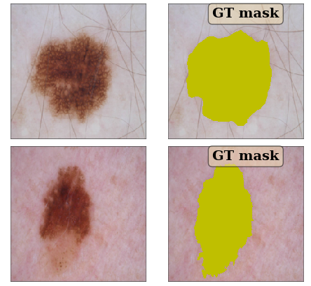
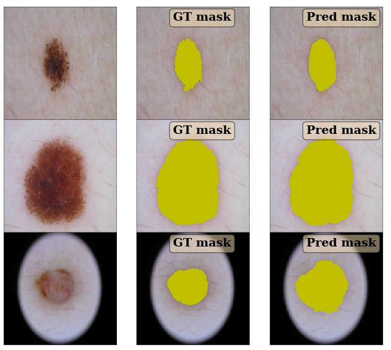
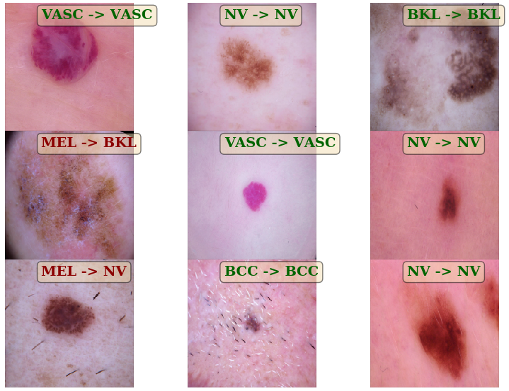

# ISIC 2018: Skin Lesion Analysis Towards Melanoma Detection 

https://challenge2018.isic-archive.com/

## Summary

**Update: July 15, 2018 to include k-fold validation and validation/test prediction and submission.**

This repository provides a starting solution for Task 1 and Task 3 of ISIC-2018 challenge based on Keras/Tensorflow. 

The current achieved performance is:

| Task 1        | Task 3  |
| ------------- | -----:|
| 81.5% mean Jaccard      | 83 % accuracy |
| 77.2% thresholded Jaccard  |  68.5% mean recall |

We support most of the backbones supported by Keras (Inception, Densenet, VGG etc.). For the segementation problems, we additionally support using Keras pre-trained backbones in a U-Net type structure. 

The code is highly configurable allowing you to change and try many aspects of the algorithm. Below, we describe how to run a baseline solution.

## Installation / setup

This code uses: Python 3.5, Keras 2.1.6, and TensorFlow 1.8.0. Please see the requirements file for needed packages.

Please make sure that your project directory is in your PYTHONPATH. 

> export PYTHONPATH="${PYTHONPATH}:yourprojectpath"

**Note** we use the developement version of scikit-image for image resizing as it supports anti-aliasing. You can install devlopement version directly from [Github](https://github.com/scikit-image/scikit-image). Alternatively, you could change the resize function in load_image_by_id in datasets/ISIC2018/\_\_init\_\_.py to not use the anti-aliasing flag.

## Data preparation

Place the unzipped ISIC 2018 data in folders datasets/ISIC2018/data. This folder should have the following subfolders:

* ISIC2018_Task1-2_Training_Input
* ISIC2018_Task1-2_Validation_Input
* ISIC2018_Task1-2_Test_Input
* ISIC2018_Task1_Training_GroundTruth
* ISIC2018_Task3_Training_GroundTruth
    * Include ISIC2018_Task3_Training_LesionGroupings.csv file. See [here](https://forum.isic-archive.com/t/task-3-supplemental-information/430) and [here](https://challenge.kitware.com/api/v1/file/5b0858b456357d4ff8575164/download)
* ISIC2018_Task3_Training_Input
* ISIC2018_Task3_Validation_Input
* ISIC2018_Task3_Test_Input

### Data pre-processing

We resize all the images to 224x224x3 size and store them in numpy file for ease/speed of processing. 
You can run datasets/ISIC2018/preprocess_data.py to do the pre-processing, or it will be done the first time you call a function that needs the pre-processed data. **This can take a few hours to complete.**

## Data visualization

You can visualize the data by running misc_utils/visualization_utils.py. You should be able to see figure likes below:

### Task 1 image

## Training/Prediction

### Task 1 (Segmentation)

#### Solution

The solution uses an encoder and a decoder in a U-NET type structure. The encoder can be one the pretrained models such as vgg16 etc. The default network that trains ok is vgg16.  Run the script runs/seg_train.py to train.

Set num_folds to 5 if you want to do 5 fold training. Set it to 1 if you want to use a single fold.

#### Task 1 results

Run the script runs/seg_eval.py to evaluate the network. We get the following on the validation set of about 400 images: Mean jaccard = 0.815, Thresholded Jaccard = 0.772 where thresholded Jaccard uses a threshold 0.65 before averaging.

##### Result Visualization

##### Task 1 prediction

Run runs/cls_predict.py to make predictions on validation and test set and generate submission. Submission will be in directory submissions.

Set:
* num_folds to 5 if you have done 5 fold training. Set it to 1 if you are using a single fold.
* Set TTA = False if you do not want to use test time augmentation (which uses rotations of the image and averages predictions)
* Set pred_set = 'test' for test set and set it 'validation' for validation set

### Task 3 (Classification)

#### Solution

The solution uses transfer learning from one the pretrained models such as vgg16 etc.  The default network that trains ok is inception_v3.  Run the script runs/cls_train.py to train.

Set num_folds to 5 if you want to do 5 fold training. Set it to 1 if you want to use a single fold.

##### Task 3 results

Run the script runs/cls_eval.py. Make sure the configuration matches the one used in runs/cls_eval.py.

The result below is based on training a single InceptionV3 model for 30 epochs, and is based on roughly 2000 validation images.

##### Confusion Matrix:
| True\Pred|        MEL|         NV|        BCC|      AKIEC|        BKL|         DF|       VASC|      TOTAL|
|   -------|    -------|    -------|    -------|    -------|    -------|    -------|    -------|    -------|
|       MEL|       0.58|       0.34|       0.01|       0.00|       0.06|       0.00|       0.00|        231|
|        NV|       0.05|       0.93|       0.01|       0.00|       0.02|       0.00|       0.00|       1324|
|       BCC|       0.07|       0.15|       0.63|       0.11|       0.03|       0.01|       0.00|         89|
|     AKIEC|       0.07|       0.10|       0.04|       0.55|       0.22|       0.00|       0.00|         67|
|       BKL|       0.08|       0.10|       0.02|       0.00|       0.79|       0.00|       0.00|        240|
|        DF|       0.17|       0.00|       0.00|       0.11|       0.06|       0.67|       0.00|         18|
|      VASC|       0.12|       0.12|       0.00|       0.00|       0.12|       0.00|       0.65|         34|
|     TOTAL|        233|       1352|         74|         53|        253|         16|         22|           |

##### Precision/Recall:

|          |        MEL|         NV|        BCC|      AKIEC|        BKL|         DF|       VASC|       MEAN|
|   -------|    -------|    -------|    -------|    -------|    -------|    -------|    -------|    -------|
| precision|      0.575|      0.907|      0.757|      0.698|      0.751|      0.750|      1.000|      0.777|
|    recall|      0.580|      0.926|      0.629|      0.552|      0.792|      0.667|      0.647|      0.685|

##### Result Visualization

Correct predictions are in **green** and wrong predictions are in **red**.

##### Task 3 prediction

Run runs/cls_predict.py to make predictions on validation and test set and generate submission. Submission will be in directory submissions.

Set:
* num_folds to 5 if you have done 5 fold training. Set it to 1 if you are using a single fold.
* Set TTA = False if you do not want to use test time augmentation (which uses rotations of the image and averages predictions)
* Set pred_set = 'test' for test set and set it 'validation' for validation set

## Miscellaneous

Backbones supported: inception_v3, vgg16, vgg19, resnet50, densenet121, densenet169, densenet201.

Model data along with logs will be written in model_data directory.

