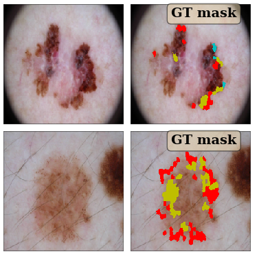

# ISIC 2018: Skin Lesion Analysis Towards Melanoma Detection 

https://challenge2018.isic-archive.com/

## Summary

This repository provides a starting solution for ISIC-2018 challenge based on Keras/Tensorflow. The current achieved performance is:

| Task 1        | Task 2           | Task 3  |
| ------------- |:-------------:| -----:|
| 81.5% mean Jaccard      | W.I.P. | 88 % accuracy |
| 77.2% thresholded Jaccard      |       |  76% mean recall |

We support most of the backbones supported by Keras (Inception, Densenet, VGG etc.). For the segementation problems, we additionally support using Keras pre-trained backbones in a U-Net type structure. 

The code is highly configurable allowing you to change and try many aspects of the algorithm. Below, we describe how to run a baseline solution.

## Installation / setup

This code uses: Python 3.5, Keras 2.1.6, and TensorFlow 1.8.0. Please see the requirements file for needed packages.

**Note** we use the developement version of scikit-image for image resizing as it supports anti-aliasing. You can install devlopement version directly from [Github](https://github.com/scikit-image/scikit-image). Alternatively, you could change the resize function in load_image_by_id in datasets/ISIC2018/\_\_init\_\_.py to not use the anti-aliasing flag.

## Data preparation

Place the unzipped ISIC 2018 data in folders datasets/ISIC2018/data. This folder should have the following subfolders:

* ISIC2018_Task1-2_Training_Input
* ISIC2018_Task1_Training_GroundTruth
* ISIC2018_Task2_Training_GroundTruth_v3
* ISIC2018_Task3_Training_GroundTruth
* ISIC2018_Task3_Training_Input

### Data pre-processing

We resize all the images to 224x224x3 size and store them in numpy file for ease/speed of processing. You can run datasets/ISIC2018/preprocess_data.py to do the pre-processing, or it will be done the first time you call a function that needs the pre-processed data. **This can take a few hours to complete.**

## Data visualization

You can visualize the data by running misc_utils/visualization_utils.py. You should be able to see figure likes below:

### Task 1 image

### Task 2 image

## Training/Prediction

### Task 1 (Segmentation)

#### Solution

The solution uses an encoder and a decoder in a U-NET type structure. The encoder can be one the pretrained models such as vgg16 etc. The default network that trains ok is vgg16.  Run the script runs/seg_train.py to train.

#### Task 1 results

Run the script runs/seg_eval.py to evaluate the network. We get the following on the validation set of about 400 images: Mean jaccard = 0.815, Thresholded Jaccard = 0.772 where thresholded Jaccard uses a threshold 0.65 before averaging.

##### Result Visualization

### Task 2 (Feature Segmentation)

##### Work in progress -- no stable results yet

Changing task_idx in runs/seg_train.py to 2 should start training for task 2. However, we have not be able to get stable results so far.

### Task 3 (Classification)

#### Solution

The solution uses transfer learning from one the pretrained models such as vgg16 etc.  The default network that trains ok is inception_v3.  Run the script runs/cls_train.py to train.

##### Task 3 results

Run the script runs/cls_eval.py. Make sure the configuration matches the one used in runs/cls_eval.py.

The result below is based on training a single InceptionV3 model for 30 epochs, and is based on roughly 2000 validation images.

##### Confusion Matrix:

| True\Pred|        MEL|         NV|        BCC|      AKIEC|        BKL|         DF|       VASC|      TOTAL|
|   -------|    -------|    -------|    -------|    -------|    -------|    -------|    -------|    -------|
|       MEL|       0.67|       0.22|       0.00|       0.00|       0.10|       0.00|       0.00|        204|
|        NV|       0.02|       0.95|       0.00|       0.00|       0.02|       0.00|       0.00|       1339|
|       BCC|       0.01|       0.09|       0.75|       0.02|       0.11|       0.02|       0.00|         93|
|     AKIEC|       0.08|       0.01|       0.07|       0.54|       0.29|       0.00|       0.00|         83|
|       BKL|       0.03|       0.08|       0.00|       0.00|       0.89|       0.00|       0.00|        234|
|        DF|       0.18|       0.05|       0.00|       0.05|       0.09|       0.64|       0.00|         22|
|      VASC|       0.00|       0.07|       0.00|       0.00|       0.00|       0.04|       0.89|         28|
|     TOTAL|        186|       1350|         80|         48|        292|         20|         27|           |

##### Precision/Recall:

|          |        MEL|         NV|        BCC|      AKIEC|        BKL|         DF|       VASC|       MEAN|
|   -------|    -------|    -------|    -------|    -------|    -------|    -------|    -------|    -------|
| precision|      0.731|      0.944|      0.875|      0.938|      0.716|      0.700|      0.926|      0.833|
|    recall|      0.667|      0.952|      0.753|      0.542|      0.893|      0.636|      0.893|      0.762|

##### Result Visualization

Correct predictions are in **green** and wrong predictions are in **red**.

## Miscellaneous

Backbones supported: inception_v3, vgg16, vgg19, resnet50, densenet121, densenet169, densenet201.

Model data along with logs will be written in model_data directory.

